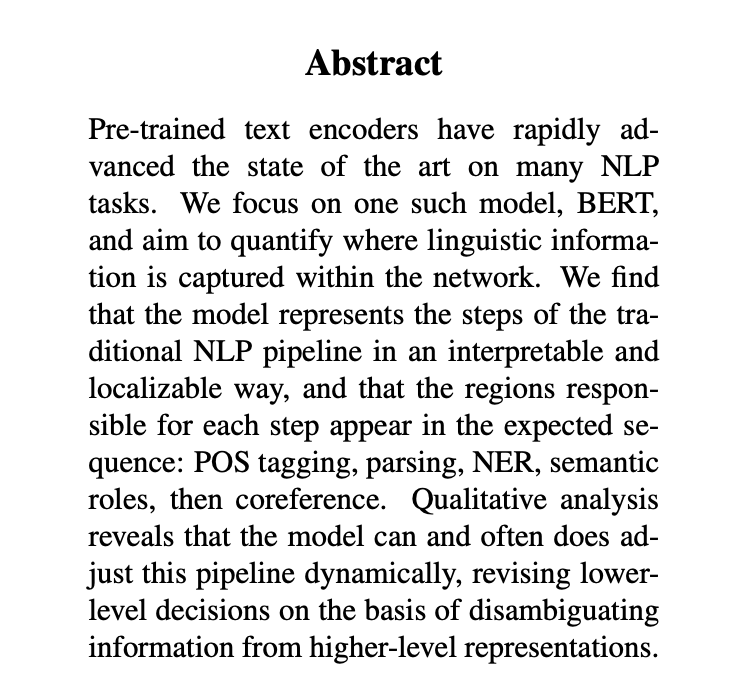

# BERT Rediscovers the Classical NLP Pipeline

**Authors:** Ian Tenney, Dipanjan Das, Ellie Pavlick  
**Year:** 2019  
**Venue:** ACL 2019  
**Citation key:** `tenney2019_bert_pipeline`  
**BibTeX entry:** [entry](../../bib.bib)  
**PDF:** [ACL Anthology](https://aclanthology.org/P19-1452.pdf)  
**Google Scholar:** [Search](https://scholar.google.com/scholar?q=Tenney+BERT+Rediscovers+Classical+NLP+Pipeline+2019)



## Summary

Uses **probing classifiers** on BERT layer representations to show that linguistic tasks (POS, parsing, NER, etc.) emerge in a **layered pipeline** reminiscent of classical NLP stacks — shallow syntax early, semantics later.

## Details

### Primer: vocabulary

**Probing** means: freeze a pretrained model, read off its internal vectors, and ask “can a *small* auxiliary classifier recover property X from those vectors?” If yes, X is (at least) **linearly decodable** at that layer — the representation encodes enough information for a simple readout, even though BERT was never trained on task X.

A **probe** is that small classifier (often a linear layer or tiny MLP) trained on top of frozen activations. It is *not* BERT itself; it is a diagnostic tool. A strong probe score means the information is *present* in the activations; it does not by itself prove BERT *uses* that information when generating text.

**Edge probing** reformulates many NLP annotation tasks into one template: predict a **label** for an **edge** in a linguistic graph. An **edge** is a typed link between pieces of the sentence — e.g. “token *runs* has POS tag VERB”, or “token *Mary* is the subject of *gave*”. The framework always gives the probe only the **span(s)** involved in that edge, not the whole sentence hidden state as an unstructured blob (though spans can be one or two token ranges). The method paper is [`tenney2019_edge_probing`](tenney2019_edge_probing.md) (ICLR 2019); this ACL paper applies it layer-wise to BERT.

A **span** is a contiguous slice of tokens, written \([i, j)\): start index \(i\), end index \(j\) (half-open interval). Examples:

- Single-token span for POS on “runs”: \([3, 4)\) → just that word.
- Two-token span for a dependency: head “gave” \([4, 5)\) and dependent “Mary” \([1, 2)\).

**Source** means the **annotated dataset** the labels come from — not “where BERT was trained”. **OntoNotes** is a large hand-labeled English corpus (news, conversational speech, etc.) with many layers of annotation: POS tags, syntax trees, named entities, semantic roles, coreference. The paper imports standard benchmarks built from these corpora. The **correct label** for an example is that human annotation (e.g. “gave” tagged `VB`); the probe’s **predicted** label is what it outputs. The paper contrasts these as correct vs incorrect labels (see their Figure 3).

**POS** = *part of speech*: grammatical category of a word (noun, verb, adjective, …). Example tags: `NN` (noun), `VB` (verb), `JJ` (adjective), `NNP` (proper noun).

Other task abbreviations in the table:

| Abbrev. | Meaning |
|---------|---------|
| Constituents | phrase-structure bracketing (NP, VP, …) |
| Dependencies | grammatical head–dependent links |
| Entities (NER) | named-entity type (PERSON, ORG, GPE, …) |
| SRL | semantic role labeling (who did what to whom) |
| Coreference | which phrases refer to the same entity |
| SPR | fine-grained semantic proto-roles (agent-like, patient-like, …) |
| Semantic relations | relation between two nominals (e.g. *founder-of*) |

### Worked example: POS probing at one layer

Sentence: **“Mary gave John a book.”**

Suppose BERT tokenizes this (simplified) as:

| index | token |
|------:|-------|
| 0 | Mary |
| 1 | gave |
| 2 | John |
| 3 | a |
| 4 | book |
| 5 | . |

**One edge** for POS on “gave”: span \(s_1 = [1, 2)\), correct label `VB` (verb).

**Step 1 — run frozen BERT.** BERT produces one hidden vector per token per layer. Notation:

\[
h^{(\ell)}_i \in \mathbb{R}^d
\]

- **Superscript \((\ell)\)** = layer number (0 = embeddings, 1…12 = transformer blocks).
- **Subscript \(i\)** = **token position** in the sentence (0 = “Mary”, 1 = “gave”, …). 

**Why does every layer have one vector per token?** BERT’s input is a *sequence* of vectors, one for each token. Each layer is a function that maps a sequence of vectors to another sequence of the same length:

\[
[h^{(\ell)}_0, h^{(\ell)}_1, \ldots, h^{(\ell)}_{n-1}] \;\mapsto\; [h^{(\ell+1)}_0, h^{(\ell+1)}_1, \ldots, h^{(\ell+1)}_{n-1}]
\]

Position \(i\) always tracks the *same word* (“gave” stays at index 1). **Self-attention** lets each position read information from all other positions, so \(h^{(\ell)}_1\) is contextualized by “Mary”, “John”, etc. — but it remains *the* representation **for** “gave”, not for “Mary”. That is why POS probing picks \(h^{(\ell)}_1\): we want the state attached to the word we are labeling.

So \(h^{(4)}_1\) means: the full \(d\)-dimensional activation vector (e.g. \(d=768\) for BERT-base) at **layer 4**, for **token position 1** (“gave”). All 768 numbers together describe “gave” in context at that depth. The probe uses the **entire** vector.

Layer 0 is the wordpiece embedding; layers 1–12 are contextual — each token’s vector depends on the whole sentence via attention.

**Target token** = the token the edge asks about. Here the POS edge is on “gave”, which sits at position \(i=1\), so the target is token 1 and we read \(h^{(\ell)}_1\) (for whatever layer \(\ell\) we are testing).

**Step 2 — pick one layer (say \(\ell = 4\)).** Take the hidden state for the target token only: \(h^{(4)}_1\) — layer 4, position 1 (“gave”). Ignore \(h^{(4)}_0, h^{(4)}_2, \ldots\) for this particular POS edge (other edges would use other positions).

**Probing is supervised**: you must choose the measurement before training. The probe does not discover “what property lives in the activations”; it tests a hypothesis you already stated (“is POS decodable at layer 4?”) using human annotations as correct labels.

| Fixed by you / the dataset | Learned by the probe |
|----------------------------|----------------------|
| Task (POS, not NER or coreference) | Weights \(W, b\) |
| Label set (`VB`, `NN`, `NNP`, …) | (in the full paper) layer-mixing coefficients |
| Correct label per example (e.g. “gave” → `VB`) | |
| Which token position to read | |

Same vector \(h^{(4)}_1\) could feed a different probe trained for NER or coreference — same activations, different supervised targets, different questions. High probe accuracy means the chosen property is **linearly decodable** at that layer; it does not prove BERT **uses** that property when generating text.

**Step 3 — train the probe.** A linear probe computes \(\hat{y} = \mathrm{softmax}(W \, h^{(4)}_1 + b)\) over POS tag vocabulary. Train \(W, b\) on thousands of such (span, label) pairs from OntoNotes; BERT weights stay fixed.

**Step 4 — interpret.** If the probe reaches high accuracy at layer 4, then by layer 4 the activation at “gave” already encodes enough information to recover its part of speech. Repeat for other layers: shallow syntax (POS) tends to become decodable in **early** layers; harder tasks (coreference) need **deeper** layers on average.

That is the whole loop: **edge** (POS on one token) → **span** (which token) → **activation** at layer \(\ell\) → **probe** predicts label → compare layers and tasks.

### From one POS edge to the full paper

The previous section is the whole method on **one** edge. The ACL paper just repeats that loop across many edges, tasks, and layers. Same sentence, three different edges:

Sentence again: **“Mary gave John a book.”**

| Task | Edge (what we ask) | Span(s) | Correct label | Vectors the probe sees |
|------|--------------------|---------|---------------|------------------------|
| POS | What is the POS of “gave”? | \(s_1=[1,2)\) | `VB` | \(h^{(\ell)}_1\) only |
| Dependency | Is “Mary” the subject of “gave”? | \(s_1=[1,2)\), \(s_2=[0,1)\) | `nsubj` | \(h^{(\ell)}_1\) and \(h^{(\ell)}_0\) |
| SRL | Is “John” the recipient of “gave”? | \(s_1=[1,2)\) (predicate), \(s_2=[2,3)\) (argument) | `ARG2` (recipient) | \(h^{(\ell)}_1\) and \(h^{(\ell)}_2\) |

For the **dependency** edge: run frozen BERT on the whole sentence as before, but the probe input is the pair of vectors at the two spans (not the whole sequence). Train a separate probe \(P_{\text{Deps}}\) that maps that pair → dependency label, using labeled edges from the English Web Treebank. Same for SRL with OntoNotes role annotations.

**Concrete prediction (dependency probe).** Fix layer \(\ell=6\). The dependency probe \(P_{\text{Deps}}\) is a classifier over a fixed label set such as:

```
{nsubj, dobj, iobj, amod, det, …}   ← dozens of dependency relation types
```

One training / test example for our sentence:

1. **Input to the probe:** the two vectors \(h^{(6)}_1\) (“gave”) and \(h^{(6)}_0\) (“Mary”), pooled into one feature vector (the paper’s span-pooling + MLP).
2. **Output:** a probability distribution over those relation labels, e.g.

```
nsubj: 0.81
dobj:  0.07
iobj:  0.04
amod:  0.01
...
```

That distribution is **not** given by the dataset. It is what the probe **computes** from its current weights: logits \(W x + b\), then `softmax`. Early in training those numbers are near-random (e.g. ~equal across labels). The **supervision** is only the correct label from the treebank annotation, usually as a one-hot target:

```
nsubj: 1
dobj:  0
iobj:  0
...
```

Training minimizes cross-entropy between the probe’s softmax and that one-hot: push probability mass onto `nsubj`, pull it off the others. After many examples, a well-trained probe outputs something like the `0.81 / 0.07 / …` sketch above on similar inputs. At **test** time the dataset still does not provide a probability distribution — only correct labels for scoring \(\arg\max\).

3. **Predicted label:** \(\arg\max\) → `nsubj` (“Mary” is the nominal subject of “gave”).
4. **Correct label** (from the treebank annotation): also `nsubj` → this example counts as correct for F1.
5. **Wrong prediction would look like:** \(\arg\max\) → `dobj` (treating “Mary” as the direct object) → incorrect for this edge.

The probe never outputs free text. It always outputs **one label from a closed list** (or a score per label). The POS probe is the same idea with a different list (`VB`, `NN`, `NNP`, …) and a single span vector.

**What the paper scales up.** Eight tasks (same template), two BERT sizes (base = 12 layers, large = 24), and for each task a probe \(P_\tau\). Metric: micro-averaged F1 over all edge decisions. Datasets (“source” = where the annotations / correct labels come from):

| Task | Span type | Source |
|------|-----------|--------|
| POS | single token | OntoNotes |
| Constituents | single span | OntoNotes |
| Dependencies | two spans | English Web Treebank |
| Entities (NER) | single span | OntoNotes |
| SRL | two spans | OntoNotes |
| Coreference | two spans | OntoNotes |
| SPR | two spans | SPR1 |
| Semantic relations | two spans | SemEval 2010 Task 8 |

The next two sections are how they turn those many per-layer probes into a **pipeline story**: which layers matter most for each task (scalar mixing), and at which layer an example first becomes correctly classified (cumulative scoring).

### Scalar mixing weights (which layers matter?)

Following ELMo, per-task **scalar mixing** pools layers into one representation before the probe:

\[
h_{i,\tau} = \gamma_\tau \sum_{\ell=0}^{L} s^{(\ell)}_\tau \, h^{(\ell)}_i, \quad s_\tau = \mathrm{softmax}(a_\tau)
\]

The coefficients \(a_\tau\) are learned jointly with the probe. After training, **center of gravity** \(\bar{E}_s[\ell] = \sum_\ell \ell \cdot s^{(\ell)}_\tau\) summarizes which depth encodes each task. Higher values → task information lives in higher layers.

### Cumulative scoring (when is an example resolved?)

Mixing weights are training-set parameters, not per-example. So the paper also trains a **family** of cumulative probes \(P^{(\ell)}_\tau\) that may attend only to layers \(0 \ldots \ell\). Define the **differential score**:

\[
\Delta^{(\ell)}_\tau = \mathrm{Score}(P^{(\ell)}_\tau) - \mathrm{Score}(P^{(\ell-1)}_\tau)
\]

The **expected layer** \(\bar{E}_\Delta[\ell]\) (Eq. 4) weights layers by \(\Delta^{(\ell)}_\tau\), omitting examples solved at layer 0 (trivial from embeddings) and remaining headroom at full depth. Intuitively: at which layer does the probe first get the label right?

### Main quantitative findings (BERT-large)

Both metrics show the same **pipeline ordering**:

**POS → constituents → dependencies → SRL → coreference**

(with entities and semantic tasks spread more diffusely).

- **Syntax is more localizable** — mixing weights for POS, constituents, and dependencies concentrate on a few layers (high KL divergence from uniform).
- **Semantics is more distributed** — SPR and relation classification have nearly uniform mixing weights; examples improve gradually across almost all layers.
- **Shortcuts vs hard cases** — cumulative scoring peaks early (layers 1–7): many examples are guessable from shallow heuristics. Mixing weights concentrate much later (layers 9–20): the probe still finds useful signal in higher layers for ambiguous cases.
- **Stretching effect** — BERT-base shows the same task order; layers for a given task sit at similar *relative* depth (near the top of the stack) when comparing 12- vs 24-layer models.

### Per-example dynamics (not a rigid pipeline)

Aggregate order does not force per-sentence processing order. Qualitative traces on ambiguous OntoNotes sentences show **revision**:

- *"he smoked toronto in the playoffs …"* — "Toronto" first tagged GPE (city); after SRL identifies it as ARG1 of "smoked", entity type revises to ORG (team).
- *"china today blacked out …"* — "today" first common noun / date; later "China Today" reinterpreted as proper noun (TV network), updating entity type and SRL.

The model can **defer** ambiguous low-level decisions and **revise** them using higher-level context — more like a bidirectional analysis than a strict feed-forward pipeline.

### Limitations (authors')

Probing shows decodability, not causal use: absence of a probe signal ≠ absence of information; presence ≠ the model relies on it at inference. Results are exploratory on one encoder (BERT); behavioral tests should complement structural probes.

## Key concepts

- **Probing** — train a small classifier on frozen hidden states to test what information is linearly decodable.  
- **Layer-wise specialization** — different layers encode different linguistic levels.  
- **Pipeline hypothesis** — depth mirrors processing stages.

## Notes

- Canonical entry point for the probing literature in the activation-steering reader.  
- HeRA reader: [`hera/readers/04-activation-steering.md`](https://github.com/alexhkurz/hera/blob/main/readers/04-activation-steering.md).
